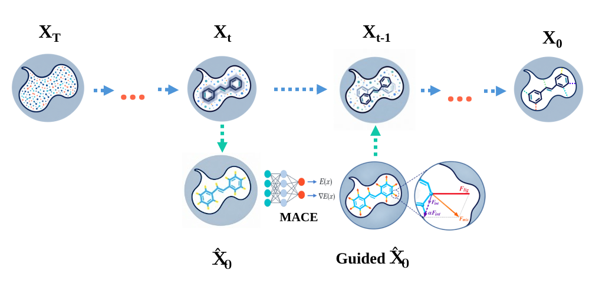

# MLIP-Diff
Interaction-Aware Physical Guidance for Diffusion-Based 3D Ligand Generation With Machine-Learning Interatomic Potentials

A training-free, inference-time module that adds machine-learning interatomic
potential (MLIP) feedback to a pretrained diffusion model. MACE-OFF24 energies
and forces are injected into the late-stage reverse-diffusion trajectory, so
generated ligand conformations are refined by atomistic physics without
retraining the generative model.



Archived release: [10.5281/zenodo.22975994](https://doi.org/10.5281/zenodo.22975994)

## Repository Structure

```
MLIP-Diff/
├── models/                          # DiffGui backbone and the physical guidance module
│   ├── model.py                     # the guidance flow and the two mode branches
│   ├── physical_guidance.py         # proxy reconstruction, MACE forces, force decomposition
│   ├── diffusion.py                 # reverse-diffusion process
│   ├── transition.py                # discrete atom and bond transition kernels
│   ├── egnn.py                      # E(3)-equivariant backbone
│   ├── bond_predictor.py            # bond-type predictor
│   └── common.py                    # shared layers
├── utils/                           # DiffGui utilities
│   ├── paths.py                     # repo-root-relative path resolution
│   ├── dataset.py  data.py          # data loading and featurisation
│   ├── transforms.py                # atom and bond featurisation
│   ├── reconstruct.py  edm_bond.py  # coordinate and bond reconstruction
│   ├── sample_utils.py              # guided-sampling helpers
│   ├── train_utils.py  warmup.py    # training helpers and LR warmup
│   ├── misc.py  parser.py           # logging and config parsing
│   ├── visualize.py                 # trajectory and structure plotting
│   └── diffgui_metrics/             # validity, uniqueness, SA and QED scoring
├── configs/sample/                  # sampling configurations
│   ├── sample.yml                   # the reported settings, demo target, 200 molecules
│   ├── smoke_test.yml               # one molecule, the quickest way to check an installation
│   └── sample_baseline.yml          # the unguided baseline
├── scripts/
│   ├── sample.py                    # guided sampling entry point
│   └── prepare_target_mace.py       # pocket preparation for both uses
├── sample/                          # pocket structures for the eight benchmark systems
├── demo/                            # 3ctj protein and reference ligand, used by the demo below
├── figures/framework.svg            # framework diagram
├── ckpt/                            # not included: place the DiffGui checkpoints here
├── env.yml                          # conda environment
├── LICENSE                          # MIT, retained from DiffGui
├── NOTICE                           # list of modifications made in this repository
└── run.sh
```

## Create the Conda Environment
```
conda env create -f env.yml
conda activate diffgui
```

See the [DiffGui repository](https://github.com/QiaoyuHu89/DiffGui) for the full
dependency list, including the `torch_cluster` / `torch_scatter` wheels matching
your CUDA and PyTorch versions.

### Files Not Included
These are obtained from their original sources and are not redistributed here.

| File | Source |
|:---|:---|
| `trained.pt` (DiffGui checkpoint) | [Google Drive](https://drive.google.com/drive/folders/1pQk1FASCnCLjYRd7yc17WfctoHR50s2r) |
| `bond_trained.pt` (bond predictor) | same folder |
| `MACE-OFF24_medium.model` | [MACE-OFF](https://github.com/ACEsuit/mace-off) |

Place the DiffGui checkpoints in the `ckpt/` folder.

## Molecular Generation

The demo target is **3ctj**, whose protein and reference ligand are provided in
`demo/`.

### Receptor Preparation
A guided run uses the pocket twice, for two different purposes, and the two uses
need different files. `prepare_target_mace.py` produces both from one
invocation:
```
python scripts/prepare_target_mace.py \
    --protein demo/3ctj_protein.pdb \
    --ligand  demo/3ctj_ligand.sdf \
    --name    3ctj \
    --outdir  sample
```

* `3ctj_pocket.pdb`: pocket residues within the radius, heavy atoms only. This is
  the DiffGui conditioning input, set as `model.target`.
* `3ctj_pocket_h.pdb`: the same residues completed and hydrogenated with
  PDBFixer. This is the MACE protein environment, set as
  `physical_guidance.pocket_pdb`.
* `full_pocket.npz`: flat coordinate and element arrays of the pocket, read by
  the evaluation scripts.

The hydrogenated pocket is not optional: polar hydrogens fix the hydrogen-bond
geometry the guidance force is computed from. Hydrogenation requires `pdbfixer`.
If it is missing, the script stops rather than emitting a non-hydrogenated file
under the `_h` name.

### Configuration
The `configs/sample/` folder ships three configurations:

| File | Purpose |
|:---|:---|
| `sample.yml` | the reported settings, demo target (3ctj), 200 molecules |
| `smoke_test.yml` | one molecule, the quickest way to check an installation |
| `sample_baseline.yml` | the unguided baseline (`enabled: false`) |

To run one of the other seven benchmark systems, change two lines:
```
model:
  target: sample/<id>_pocket.pdb
sample:
  physical_guidance:
    pocket_pdb: sample/<id>_pocket_h.pdb
```

### Guidance Mode
Exactly one mode is selected in the sampling config. They are mutually
exclusive, and a config naming any other mode is rejected at load time rather
than silently falling back to a different one.
```
sample:
  physical_guidance:
    complex_force: true          # or:
    # interaction_aware: true
    # alpha: 5.0
```

| Mode | Guidance force | Character |
|:---|:---|:---|
| `complex_force` | the complex force, weighted per atom by its magnitude | the whole ligand-protein force drives the step |
| `interaction_aware` | `F_lig + alpha * F_int` | the protein-induced interaction component is amplified relative to the ligand's own relaxation |

`alpha` (default **5.0**) is the amplification factor of the interaction
component in `interaction_aware` mode. `alpha = 0` gives pure ligand relaxation,
`alpha = 1` reproduces the natural resultant force.

Both modes scale the correction by the current diffusion step's own
coordinate-update magnitude: the direction comes from physics, the spatial scale
from the diffusion trajectory.

### Running the Sampling
```
python scripts/sample.py --outdir ./outputs \
    --config ./configs/sample/sample.yml --device cuda:0
```

## Configuration Reference
All keys live under `sample.physical_guidance` in the YAML.

### Guidance Schedule

| Key | Default | Meaning |
|:---|:---|:---|
| `enabled` | `false` | `true` turns guidance on; `false` is the unguided baseline |
| `mode` | `mace_only` | the only supported physical evaluation mode |
| `start_step` | `200` | guidance acts while `step <= start_step`, i.e. on the last N denoising steps |
| `interval` | *(required)* | apply the correction every N steps |
| `readiness` | `false` | **set to `true`.** Enables the chemistry-aware proxy reconstruction. Without it the loader falls back to a legacy path that does not build a proxy, and hard-codes the proxy confidence to `1.0` |
| `overall_scale` | `1.0` | global multiplier on the assembled step |

Settings used for the reported results: `start_step: 25`, `interval: 1`,
`readiness: true`.

### Force Shaping

| Key | Default | Used by | Meaning |
|:---|:---|:---|:---|
| `dir_scale` | `0.1` | both | strength of the coordinate correction |
| `tanh_c` | `3.0` | both | soft compression ceiling on the per-atom force weight |
| `w_max` | `3.0` | both | hard cap on the per-atom weight |
| `quantile` | `0.90` | both | fraction used for the robust force scale |
| `alpha` | `5.0` | `interaction_aware` | amplification of the interaction component |
| `clamp_stretch` | `true` | both | scale the step down if any bond would stretch too far |
| `max_stretch` | `0.3` | both | the bond-stretch limit, in Å, that triggers the clamp |

### Diagnostics (Optional)

| Key | Meaning |
|:---|:---|
| `guidance_log` | per-step CSV: one row per guidance step, with forces, scales and energies |
| `guidance_atom_log` | per-atom CSV: displacement, direction cosine against `F_int`, and per-atom `\|F_lig\|`, `\|F_int\|`, `\|F_total\|` |

`guidance_atom_log` is only written when `guidance_log` is also set.

## Data
This repository holds code only. The generated ligand conformations and the
energetic and structural evaluation results for the eight benchmark systems are
released through Zenodo: `https://doi.org/10.5281/zenodo.22975994`.

Unguided and guided structures are paired by canonical SMILES, so every
comparison is made between identical molecular identities.

## Method
The generative backbone is [DiffGui](https://github.com/QiaoyuHu89/DiffGui), an
E(3)-equivariant diffusion model that jointly generates ligand atom types, bond
types and 3D coordinates under a protein-pocket condition. The guidance module is
added purely at inference time: nothing is trained and DiffGui's own weights are
never modified.

Late in the denoising trajectory, the predicted ligand state is rebuilt into a
chemistry-aware proxy and evaluated with **MACE-OFF24(M)** under a fixed local
protein environment. Two MACE evaluations separate the two physical
contributions:

| Evaluation | System | Force |
|:---|:---|:---|
| Complex | ligand proxy + fixed local protein environment | `F_total` |
| Isolated | ligand proxy alone | `F_lig` |

The interaction-related component is their difference:
```
F_int = F_total - F_lig
```

It carries the change in ligand forces caused by the protein environment, rather
than bulk conformational relaxation of the ligand itself. Atom and bond
identities keep following the original DiffGui discrete transition process
throughout: only the continuous coordinate trajectory is modified.

## Path Configuration
No script hardcodes an absolute path. All base directories are resolved relative
to the repository root by `utils/paths.py`, so a fresh clone runs from wherever
you put it. Override with environment variables if your layout differs:

| Variable | Default | Meaning |
|:---|:---|:---|
| `MLIPDIFF_ROOT` | auto-detected repo root | repository root |
| `MLIPDIFF_DATA` | `<root>/data` | shipped results |
| `MLIPDIFF_VALIDATION` | `<root>/validation` | raw sampling output |
| `MLIPDIFF_WORK` | `<root>/work` | scratch |
| `MLIPDIFF_MACE_MODEL` | `~/.cache/mace/MACE-OFF24_medium.model` | MLIP checkpoint |

Note: `mace_model_path` in a sampling config is used as written. It is not
tilde-expanded. Give it an absolute path, or export `MLIPDIFF_MACE_MODEL`.

## License
This work builds on DiffGui, which is licensed under the MIT License. The
original copyright notice is retained in `LICENSE`.

* DiffGui: https://github.com/QiaoyuHu89/DiffGui, Copyright (c) 2024 Qiaoyu Hu
* See `NOTICE` for the list of modifications made in this repository.

## Citation
```
@article{
  title={Interaction-Aware Physical Guidance for Diffusion-Based 3D Ligand Generation With Machine-Learning Interatomic Potentials},
  author={Hejing Huo, Jinfeng Liu},
  journal={Under submission},
  year={2026},
  url={https://github.com/huohejing/MLIP-Diff}
}
```
